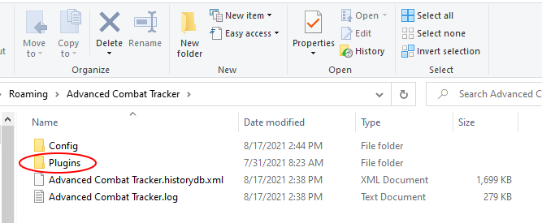

# Spell Damage Tracker Plugin for Advanced Combat Tracker
This plugin was written to help track incoming damage during a fight for specified spells.

The intent is to make it easier to see when a damage threshold is reached by a spell whose damage increments over time or range.

The plugin looks for damage to specified players by specified spells. Each player/spell combination must manually be entered in the list. A representitive example is shown below:

When and __Active__ checkbox is checked, the damage form opens for that __Player__ and __Spell__. An example form for a single checkbox is shown below:

Multiple checkboxes add multiple damage trackers. Resizing the form adjusts the damage trackers to try to make best use of the area. Unchecking an __Active__ checkbox removes the data from the form.

During combat, matching data is displayed on the form. An example is shown below.

The __Swing__ column is the addition of the __Landed__ and __Warded__ columns and should be how hard the mob tried to hit the player. __Landed__ is how much damage the player actually took. __BT__ is bleedthrough, for reference, and typically matches __Landed__.

# Changes
## Version 1.0.1
* Remember the damage form's location when it was not opened.

# Limitations (Known and Suspected)
* In EQII, the __Warded__ data is inconsistent. For example, the __Xenolith__ spell is a group ward but the EQII log file typically only logs the ward on one player instead of the entire group. In the form, the __Warded__ column will be zero even though the player was warded. This also undervalues the __Swing__ column by the (missing) warded amount.
* Since this data is reported during combat "in real time", there is the distinct possibility for lag if trying to track "a lot" of players. The definition of "a lot" will depend upon your computer system.

# Installation

If you already have a version installed and enabled, the following sections are not relevant. You will get a prompt to update to the latest version when you run ACT if ACT's __Auto Version Check__ checkbox is checked.

Otherwise, the plugin must be manually downloaded and installed. 
The steps you will be taking are:
* Download the `Hurts.dll` file from the Releases page. 
  * You will need to leave this instructions page to do so.
* Install the downloaded file in ACT. 
  * Install instructions are on this page. Come back to this page after the download if you need to. 

Details are provided below. 

## Download

1. You might want to first read through all the steps since you will be leaving this page.
2. To go to the download page, click the following link: [Releases Page](https://github.com/jeffjl74/ACT_Hurts/releases)
3. On the "Releases" page, for the __Latest release__, click the "Assets 3" title to expand the assets (if needed). 
The page with the expanded view will list three files.
4. Click the `Hurts.dll` link, download and save the file. 
	* Pay attention to where the file was downloaded. 
It will typically be in your "Downloads" folder.
In most browsers, you can select some form of _Show in folder_ after the download to open the folder in File Explorer.

## Add the plugin to ACT
### Move the downloaded file (optional)
The `Hurts.dll` file may be used right where you downloaded it, or use the following steps to put it in
the folder in which ACT normally saves plugins.

1. In Windows, open a File Explorer and browse to wherever you saved the `Hurts.dll` file, 
(typically the _Downloads_ folder) 
select it and choose either _Copy_ or _Cut_.
2. ACT's preferred folder is accessed from the _App Data Folder_ link in the About tab in ACT. Click that link, shown below:

3. Then double-click the _Plugins_ folder in File Explorer

4. Paste the `Hurts.dll` file in the _Plugins_ folder.

### Add/Enable the plugin in ACT
1. In ACT, click the "Plugins" tab and its "Plugin Listing" tab. 

2. Click the [Browse...] button and navigate to where you saved `Hurts.dll`
   * If you moved `Hurts.dll` to the _Plugins_ folder, you can get there by entering 
   `%appdata%\Advanced Combat Tracker\Plugins` 
   in the File Explorer navigation bar as shown below 

3. Select the `Hurts.dll` file and press [Open]. 
Then press the [Add/Enable Plugin] button. 

You should now have a `Hurts.dll` tab in your plugins tabs. Click on the tab to see the (empty) table. 

